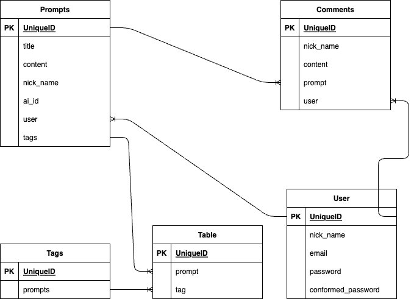

# Prompter
# アプリケーション概要
対話型AIに対して行う指示や質問を収集、再利用するサイトです。
## webサイト
### url
[Prompter](http://54.199.100.28/)
### ID
```
admin
```
### password
```
2222
```
## 利用方法
- プロンプト投稿
  * プロンプト投稿ボタンを押す。　投稿ページへ遷移
  * フォームを埋めて、投稿ボタンを押す。
- 一覧からプロンプトを入手
  * コピーボタンを押して、プロンプトをコピー
  * AI名からリンク先に遷移し、コピーしたプロンプトを利用。
## アプリケーションを作成した背景
  私がこのアプリケーションを開発した目的は、対話型AI利用における課題を解決することです。  
AIへの質問文、つまりプロンプト作成を補助しAIから実用的な出力を手軽に得られるようにしています。  
ChatGPTなどの対話型AI利用は2つの段階に分けられます。初回の質問と、既存のプロンプトを再利用した質問です。

  多くのユーザーは既存情報の具体化や整理の目的でChatGPTを利用します。具体的には、文章の添削、校正、基本的なアイデア提案、小説やキャラクターの作成、スクリプト生成などです。一度うまくいけば、固有名詞を変えるだけでプロンプトを使いまわせます。　

  しかし、まったく無知な分野に関する質問文作成に対してはあてはまりません。AIに初めから利用できる回答を出力してもらうには、知識や重要な情報、AIの知らない最新の情報を具体的に整理した形で提供する必要があるからです。良いプロンプトを作成するには、自らの理解度を高めなければなりません。

  そこで、初めから完成されたプロンプトがあれば、初回の質問文作成という段階を飛ばして、固有名詞を入れ替えるだけで実用的なプロンプトを入手できると考えました。実際に私が勤めていたアルバイト先では、上司がすでに用意していたプロンプトを私たちアルバイトが再利用し、文章の校正やWebサイトに載せる文章作成などを行なっていました。

  このWebアプリ「Prompter」では、誰でもプロンプトを公開でき、別のユーザーは公開されたプロンプトを再利用できます。閲覧者はプロンプトをすべて書かずとも、いいねの数が多いプロンプトをコピーして再利用するだけで、AIから良い回答を入手できます。また、投稿者も、投稿されたプロンプトへのコメントを参考にしてプロンプトをブラッシュアップしていけます。


# DataBase setting
## Table
### Prompts
| Column | Type | Options |
| --- | --- | --- |
| title | string | null: false |
| content | text | null: false |
| nick_name | string | null: false<br>default: 'prompter'|
| ai_id | integer | null: false<br>default:'1'|
| ip| references | null: false<br>foreign_key:true | 
| category | references | null: false<br>foreign_key:true|
<!--tagを実装するならば-->
---
### Comments
| Column | Type | Options |
| --- | --- | --- |
| nick_name | string |null: false<br>default:'commenter'|
| content | text | null: false |
| prompt | references | null: false<br>foreign_key:true|
| ip | string | null: false<br>foreign_key:true | 

### Likes
<!--cookie上に保存?-->
<!--後から拡張しやすいようにcountは入れない-->
| Column | Type | Options |
| --- | --- | --- |
| prompt| references |null: false<br>foreign_key:true|s

### PromptTagRelations
| Column | Type | Options |
| --- | --- | --- |
| prompt | references | null: false |
| tag | references | null: false |

### Ip
| Column | Type | Options |
| --- | --- | --- |
| ip_md5_head8 | string | null: false|

### Category
| Column | Type | Options |
| --- | --- | --- |
| name | string | null: false |
| ancestor | string| null: true |
---
## Association
### Prompts
belongs_to :ip
<!--When generate comments_controller-->
has_many:comments
<!--When generate likes_controller-->
has_many:likes
<!--When generate tags_controller-->
belongs_to: category
### Comments
belongs_to :ip
### Likes
belongs_to :ip
belongs_to :prompt
---
# ER図


## 開発環境
- フロントエンド:Ruby,JavaScript,bootstrap
- バックエンド:Ruby
- インフラ:AWS
- テキストエディター:VScode

## ローカルでの動作方法
以下のコマンドを順に実行します。
```sh
git clone https://github.com/Takenoko463/prompter.git
```
```sh
cd prompter
```
```sh
bundle install
```

## 工夫したポイント
私がこのアプリでターゲットにしたユーザーは、自身の作業を可能な限り減らしたいと考えている方達です。そのため、ユーザーに負担となる動作を減らしました。
- コピーボタン:プロンプトを範囲指定する動作を除去しました。
- 一般ユーザーはIPで区別:アカウント作成、ログイン、ログアウト動作を除去しました。

## [Prompter](http://54.199.100.28/)利用マニュアル
### プロンプト再利用
気にいったプロンプトをコピー、そのままchatGPT等で再利用できます
[](https://gyazo.com/0c8e0bf4e3c2c26117cacf87be42e699)
### プロンプト投稿
自分の利用したプロンプトを公開します。
#### 投稿ページへの遷移
[](https://gyazo.com/1f02838cd36dec7375481408557a3c70)
#### プロンプト投稿
[](https://gyazo.com/6b2127ebef28bfd2b6f4098987d67c36)
### プロンプト編集
公開済みのプロンプトを編集します。ただし、編集権限は公開した方と同一IPの方にしかありません。
#### プロンプト編集ページへの遷移
[](https://gyazo.com/e48d3973356baa4fc720572dc5d67039)
#### プロンプト編集実行
[](https://gyazo.com/96f08c6ae7c5a4c39feeb7df4153d21e)
### プロンプト削除
公開済みのプロンプトを削除します。ただし、削除権限は公開した方と同一IPの方にしかありません。
[](https://gyazo.com/66eef5d28165f045dd10a1f969195c1b)
### カテゴリ変更
指定したカテゴリに属すプロンプトのみを表示します。
[](https://gyazo.com/508f0533af292307121cecb141b646c0)
### いいねを押す
気に入ったプロンプトにはいいねをつけておけます。
[](https://gyazo.com/06da6055649d496b83deb894ba1306dd)