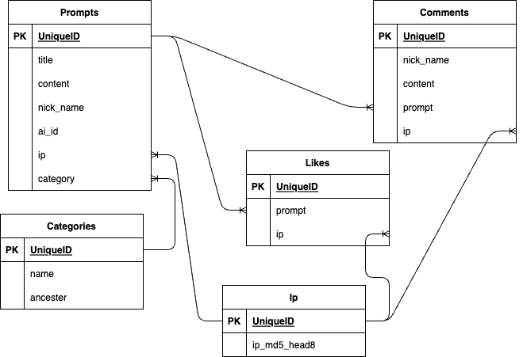

# Prompter
# アプリケーション概要
対話型AIに対して行う指示や質問を収集、再利用するサイトです。
## webサイト
### url
[Prompter](http://54.199.100.28/)
### ID
```
admin
```
### password
```
2222
```
## 利用方法
- プロンプト投稿
 * プロンプト投稿ボタンを押す。　投稿ページへ遷移
 * フォームを埋めて、投稿ボタンを押す。
- 一覧からプロンプトを入手
 * コピーボタンを押して、プロンプトをコピー
 * AI名からリンク先に遷移し、コピーしたプロンプトを利用。
## アプリケーションを作成した背景
  このアプリケーションを開発した背景は、いくつかの課題に直面したことにあります。まず、対話型AI（例: ChatGPT）がユーザーからの指示や質問に適切に応えられない場合があります。これは、ユーザーが情報を提供しきれず、あいまいな情報しか与えていないためです。その結果、AIが正確な回答を提供するのが難しくなることがあります。  
また、プロンプト一覧をまとめたサイトが不足しています。プロンプトは、対話型AIが適切な回答を生成するための重要な要素ですが、これらのリソースが不足しているため、効果的なプロンプトを見つけることが困難です。  
さらに、プロンプトの作成方法に関する情報はあるものの、実際に流用できるテンプレートが見当たりませんでした。これは、プロンプトの作成において実践的な支援が必要であることを示しています。  
とくに、ChatGPTを利用していたバイト先でこれらの問題に直面しました。作業の内容は、既存の記事を改善する際にChatGPTを活用するバイトです。しかし、上記の理由から適切なプロンプトを見つけることが難しく、苦労しました。そこで、Web上でプロンプトが集まっているプラットフォームがあれば、これを活用して作業を効率化できると考えました。
# DataBase setting
## Table
### Prompts
| Column | Type | Options |
| --- | --- | --- |
| title | string | null: false |
| content | text | null: false |
| nick_name | string | null: false<br>default: 'prompter'|
| ai_id | integer | null: false<br>default:'1'|
| ip_md5_head8| string | null: false | 
| tags | references | null: false<br>foreign_key:true|
| user | references | null: false<br>foreign_key:true| 
<!--tagを実装するならば-->
<!--userを実装するならば-->
---
### Comments
| Column | Type | Options |
| --- | --- | --- |
| nick_name | string |null: false<br>default:'commenter'|
| content | text | null: false |
| prompt | references | null: false<br>foreign_key:true|
| ip_md5_head8 | string | null: false | 
| user | references | null: false<br>foreign_key:true|

### Likes
<!--cookie上に保存?-->
<!--後から拡張しやすいようにcountは入れない-->
| Column | Type | Options |
| --- | --- | --- |
| prompt| references |null: false<br>foreign_key:true|
### Favorites
<!--cookie上に保存?-->
<!--後から拡張しやすいようにcountは入れない-->
| Column | Type | Options |
| --- | --- | --- |
| prompt| references |null: false<br>foreign_key:true|
### Tags
| Column | Type | Options |
| --- | --- | --- |
| prompt | references | null: false|

### PromptTagRelations
| Column | Type | Options |
| --- | --- | --- |
| prompt | references | null: false |
| tag | references | null: false |

### Users
| Column | Type | Options |
| --- | --- | --- |
| nick_name | string| null: false |
| email | string | null:false |
| encrypted_password | string | null:false |
---

## Association
### Prompts
<!--When generate comments_controller-->
has_many:comments
<!--When generate likes_controller-->
has_many:likes
<!--When generate favorite_controller-->
has_many:favorites
<!--When generate tags_controller-->
has_many:tags,throw prompt_tag_relations 
<!--When generate user_controller-->
belongs_to:user
### Comments
<!--When generate user_controller-->
belongs_to:user
### Likes
<!--When generate user_controller-->
### Favorites
<!--When generate user_controller-->
### Tags
### User

---
# ER図


## 開発環境
- フロントエンド:Ruby,JavaScript
- バックエンド:Ruby
- インフラ:AWS
- テキストエディター:VScode

## ローカルでの動作方法
以下のコマンドを順に実行します。
```sh
git clone https://github.com/Takenoko463/prompter.git
```
```sh
cd prompter
```
```sh
bundle install
```

## 工夫したポイント
私がこのアプリでターゲットにしたユーザーは、自身の作業を可能な限り減らしたいと考えている方達です。そのため、ユーザーに負担となる動作を減らしました。
- コピーボタン:プロンプトを範囲指定する動作を除去しました。
- 一般ユーザーはIPで区別:アカウント作成、ログイン、ログアウト動作を除去しました。